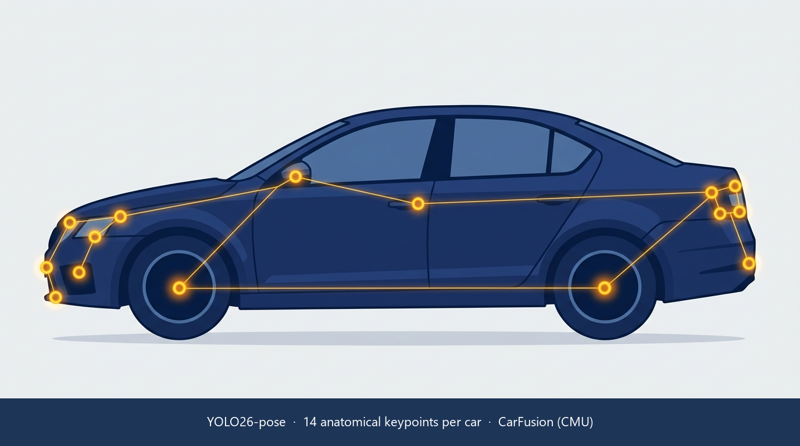

# vehicle-keypoints

Production-grade 14-keypoint vehicle pose estimation on CarFusion — YOLO26-pose (main) + ViTPose-S (baseline).

[](https://github.com/kiselyovd/vehicle-keypoints/actions/workflows/ci.yml)
[](https://kiselyovd.github.io/vehicle-keypoints/)
[](https://codecov.io/gh/kiselyovd/vehicle-keypoints)
[](LICENSE)
[](https://www.python.org/)
[](https://huggingface.co/kiselyovd/vehicle-keypoints)

End-to-end toolkit for detecting vehicles and regressing **14 anatomical keypoints per car** (wheels, head- and tail-lights, roof corners, exhaust, body centre) on the CarFusion (CMU) dataset. The main model is a single-stage **YOLO26-pose** detector (Ultralytics); the baseline is a top-down **ViTPose-S** wrapped in PyTorch Lightning and fed by a YOLO car detector. The stack is Hydra-configured, trained from the CLI, evaluated with OKS-mAP + PCK@0.05, served over FastAPI + Docker, documented with MkDocs Material, and distributed through the Hugging Face Hub. Research and education only — **not a primary sensor for autonomous driving**.



> **Part of the [kiselyovd ML portfolio](https://github.com/kiselyovd#ml-portfolio)** — production-grade ML projects sharing one [cookiecutter template](https://github.com/kiselyovd/ml-project-template).

📖 [English docs](https://kiselyovd.github.io/vehicle-keypoints/) • 🇷🇺 [Русский README](README.ru.md) • 🤗 [HF Hub model](https://huggingface.co/kiselyovd/vehicle-keypoints)

## Dataset

[CarFusion](http://www.cs.cmu.edu/~mvo/index_files/CarFusion.html) — a multi-view traffic-scene dataset from Carnegie Mellon University (Dinesh Reddy, Minh Vo, and Srinivasa Narasimhan, CVPR 2018) with **14 keypoint annotations per car**. The raw release is pre-converted to COCO-keypoints JSON via `scripts/convert_carfusion_to_coco.py`, and `src/vehicle_keypoints/data/prepare.py` applies a **scene-level 90/10 split** across the 8 training scenes (val = `car_craig2`, the other 7 go to train) so no scene appears in more than one partition.

Resulting image counts: **16,713 train / 3,474 val / 12,761 test**. CarFusion is © CMU and released under its own research-only license.

## Results

Test-set metrics after full training (filled in from `reports/metrics.json` once the v0.1.0 run completes):

| Model | OKS-mAP | OKS-mAP50 | PCK@0.05 |
|---|---|---|---|
| **YOLO26-pose** (main) | — | — | — |
| ViTPose-S (baseline) | — | — | — |

Metrics computed with pycocotools + custom PCK@0.05 on the CarFusion test split (12,761 images). Filled after v0.1.0 training run.

## Quick Start

```bash
uv sync --all-groups
bash scripts/sync_data.sh "D:/ProjectsData/Car Key Point/datasets/carfusion"
uv run python -m vehicle_keypoints.data.prepare --raw data/raw --out data/processed
make train     # main YOLO26-pose (~90 min RTX 3080)
make evaluate  # OKS-mAP + PCK on test
make serve     # FastAPI on :8000
```

## Full Training Commands

**Main — YOLO26-pose:**

```bash
uv run python -m vehicle_keypoints.training.train +experiment=sota trainer.max_epochs=100
```

**Baseline — ViTPose-S (top-down, Lightning):**

```bash
uv run python -m vehicle_keypoints.training.train_vitpose model=baseline trainer.max_epochs=30
```

## Inference

```python
from huggingface_hub import hf_hub_download
from vehicle_keypoints.inference.predict import Detector

ckpt = hf_hub_download(repo_id="kiselyovd/vehicle-keypoints", filename="weights.pt")
det = Detector.from_checkpoint(ckpt)
detections = det.predict("car.jpg")
for d in detections:
    print(d["bbox"], d["score"], len(d["keypoints"]))
```

Each detection is a dict with an xyxy `bbox`, a detector `score`, and a list of 14 `(x, y, visibility)` keypoints aligned to the CarFusion skeleton.

## Serving

```bash
docker compose up api
```

JSON response (keypoints + boxes):

```bash
curl -X POST -F file=@car.jpg http://localhost:8000/detect
```

Overlay PNG (skeleton drawn on the input image):

```bash
curl -X POST -F file=@car.jpg "http://localhost:8000/detect?overlay=true" -o overlay.png
```

## Project Structure

```
vehicle-keypoints/
├── configs/              # Hydra
├── data/                 # raw + processed + sample (CI)
├── docs/                 # MkDocs Material
├── scripts/              # convert_carfusion_to_coco.py, build_sample_data.py, publish_to_hf.py, ...
├── src/vehicle_keypoints/
│   ├── data/             # prepare.py, coco_dataset.py, datamodule.py
│   ├── models/           # factory.py, vitpose.py, lightning_module.py
│   ├── training/         # train.py (YOLO), train_vitpose.py (Lightning)
│   ├── evaluation/       # evaluate.py (OKS-mAP + PCK)
│   ├── inference/        # predict.py, overlay.py
│   └── serving/          # FastAPI /detect
└── tests/
```

## Intended Use

Computer-vision research and education only. CarFusion is small, single-domain, and not representative of all driving conditions. **Not suitable as a primary sensor for autonomous driving; not safety-certified.**

## License

MIT — see [LICENSE](LICENSE). Model weights on HF Hub ship under the same terms; the CarFusion dataset is © CMU and subject to its own research license.
