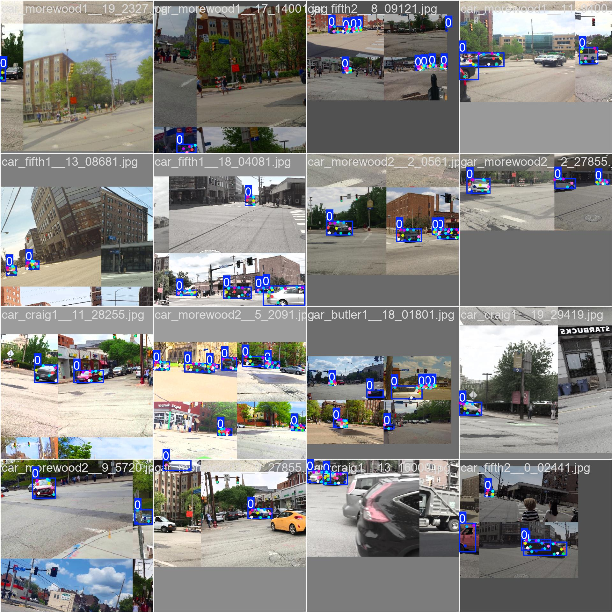
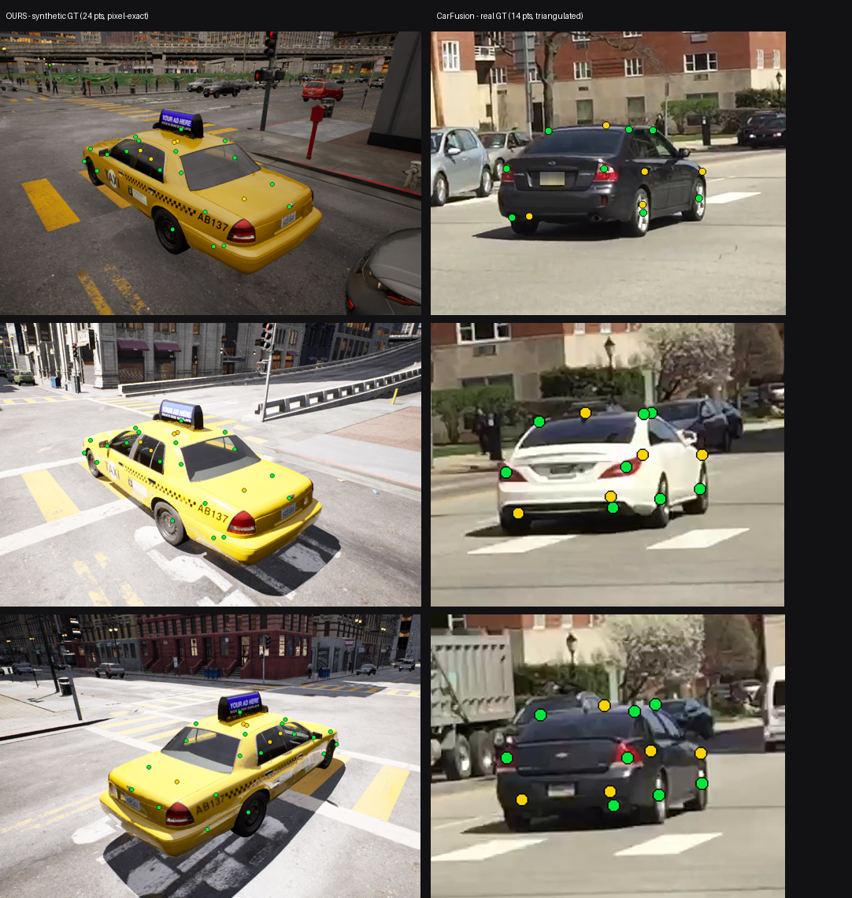

# Synthetic pre-training experiment (Phase 0)

Can synthetic data rendered in a game engine improve a real-world vehicle-keypoint
model? This page reports the experiment honestly - including a training bug the
investigation uncovered that turned out to matter far more than the synthetic data
itself.

The synthetic data comes from [**ue5-vehicle-synth**](https://github.com/kiselyovd/ue5-vehicle-synth):
1,440 frames rendered in Unreal Engine 5's City Sample across 4 venues x 3 lighting
conditions x 4 vehicles, with a 24-point keypoint schema (the first 14 match this
repo's CarFusion canonical order). Dataset:
[kiselyovd/citysample-vehicle-keypoints-24pt](https://huggingface.co/datasets/kiselyovd/citysample-vehicle-keypoints-24pt).

The kill switch: synthetic pre-training must lift OKS-mAP by **+2 pp** on the
held-out CarFusion test set (12,761 frames), or the approach is reconsidered.

## The headline finding: a flip-augmentation bug, not the synthetic data

Auditing the training pipeline revealed that **every** run - including the original
v1 baseline - used ultralytics' default `fliplr=0.5` with an **identity** keypoint
`flip_idx`. Horizontal-flip augmentation therefore mirrored the image **without
swapping left/right keypoints**: the "left wheel" label stayed on the left index
while the wheel moved to the right of the image, corrupting keypoints on ~half of
the augmented samples.

Fixing `flip_idx` to the correct left/right swap (`[1,0,3,2,5,4,7,6,8,10,9,12,11,13]`)
and re-running the **same** recipe (full CarFusion, 30 epochs) on the real data alone:

| Model | OKS-mAP | OKS-mAP@50 | PCK@0.05 |
|---|---|---|---|
| v1 baseline (identity flip_idx) | 0.2199 | 0.350 | 0.496 |
| **baseline, corrected flip_idx** | **0.5038** | **0.704** | **0.761** |
| **delta** | **+28.4 pp** | +35 pp | +27 pp |

One-line augmentation fix **more than doubled** the model's accuracy. This corrected
model is now the one published at
[kiselyovd/vehicle-keypoints](https://huggingface.co/kiselyovd/vehicle-keypoints).

## The kill switch, measured correctly

With the flip fix in place, both arms were re-run fresh from the corrected baseline
checkpoint - identical settings, the only difference being the synthetic data:

| Run | OKS-mAP | delta vs v1 |
|---|---|---|
| arm B - control (100 real, oversampled x8, **no synth**) | 0.3808 | +16.1 pp |
| arm A - mixed (synth + 100 real x8) | 0.3575 | +13.8 pp |

**Synthetic contribution: arm A − arm B = −2.3 pp.** Against the *original* gate
(0.2399, derived from the buggy v1) both arms "pass", but that gate is obsolete - the
corrected control alone clears it. The fair comparison is arm A vs arm B, and there
the synthetic data is **~2 pp below** the real-only control.

## Why that −2 pp is not the whole story

CarFusion is a **noisy yardstick**. Its ground truth is multi-view-triangulated and,
even on its best-labelled cars, sparse and visibly scattered. Our synthetic labels
are **pixel-exact by construction** (projected from the 3D mesh). Measured against a
noisy reference, a model pulled toward the cleaner synthetic convention scores
*lower* - the −2 pp conflates label-convention mismatch with true transfer quality.

Two facts support that the synthetic **data** is high quality, independent of the
CarFusion comparison:

- A model trained **only** on the synthetic frames reaches **0.86 box mAP@50** on
  held-out synthetic frames - the 24-point labels are clean and learnable.
  ([synthetic model on the Hub](https://huggingface.co/citysample-vehicle-keypoints-24pt).)
- The labels are pixel-exact by construction (above), denser (24 vs 14 points), and
  complete (no occlusion-triangulation gaps).

## Honest conclusion

- The dominant real-world win was an **engineering fix** (correct flip augmentation,
  +28 pp), not the synthetic data. Rigor on the training loop mattered more than the
  data source.
- On the CarFusion-graded kill switch, synthetic pre-training lands **~2 pp under** a
  strong real-only control - statistically a wash given CarFusion's own label noise,
  and partly a label-convention artifact rather than a quality gap.
- The synthetic dataset is demonstrably high quality (in-domain learnability +
  pixel-exact construction); a fair real-world test would need a real test set
  labelled in the same convention.

## What's next

- A learned **monocular 3D / 6-DoF pose** model - the synthetic pipeline can emit
  exact per-keypoint 3D and object pose for free, which real datasets cannot. This is
  the use of synthetic data that real data genuinely cannot match.
- A cleaner real benchmark (or human-verified labels) to evaluate transfer without
  the CarFusion label-noise confound.

## Artifacts

- Updated real-world model: [kiselyovd/vehicle-keypoints](https://huggingface.co/kiselyovd/vehicle-keypoints) (OKS-mAP 0.50)
- Synthetic-only 24-pt model: [kiselyovd/citysample-vehicle-keypoints-24pt](https://huggingface.co/citysample-vehicle-keypoints-24pt)
- Synthetic dataset: [kiselyovd/citysample-vehicle-keypoints-24pt](https://huggingface.co/datasets/kiselyovd/citysample-vehicle-keypoints-24pt)
- Generator + pipeline: [github.com/kiselyovd/ue5-vehicle-synth](https://github.com/kiselyovd/ue5-vehicle-synth)
